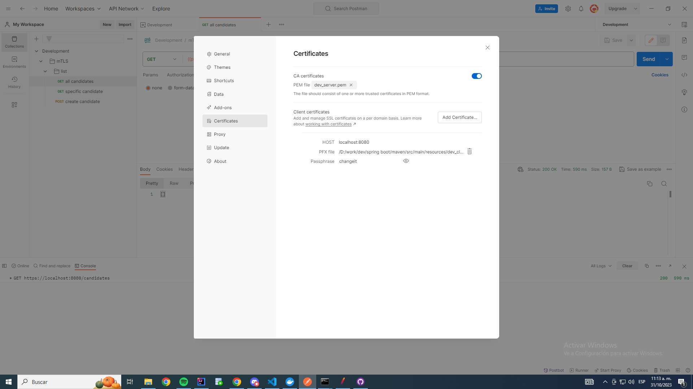

# SSL

## 1. Generar par de llaves (pública y privada)
a. Generar par de llaves
    keytool -genkeypair -alias dev_server -keyalg RSA -keysize 2048  -validity 3650 -keystore dev_server.p12 -storeType PKCS12 -keypass changeit -storepass changeit -dname "CN=localhost"
    keytool -genkeypair -alias dev_client -keyalg RSA -keysize 2048  -validity 3650 -keystore dev_client.p12 -storeType PKCS12 -keypass changeit -storepass changeit -dname "CN=localhost"
b. Exportar certificados públicos
    keytool -v -exportcert -file dev_server_public_key.cer -alias dev_server -keystore dev_server.p12 -storepass changeit
    keytool -v -exportcert -file dev_client_public_key.cer -alias dev_client -keystore dev_client.p12 -storepass changeit
c. Crear trust stores a partir de los certificados públicos
    keytool -v -importcert -file dev_server_public_key.cer -alias dev_server -keystore dev_server_trust_store.jks -storepass changeit -noprompt
    keytool -v -importcert -file dev_client_public_key.cer -alias dev_client -keystore dev_client_trust_store.jks -storepass changeit -noprompt
    

## EXTRAS
1. Probar certificado con CMD (sale CERT_TRUST_IS_UNTRUSTED_ROOT)
    cd "D:\work\dev\spring boot\maven\src\main\resources"
    curl https://localhost:8080/candidates --cert "dev_client_public_key.cer" --cacert "dev_server_public_key.cer" --cacert "dev_server_public_key.cer"
2. Configurar certificado TLS y mTLS con POSTMAN
    1. Añadirlo a postman
        